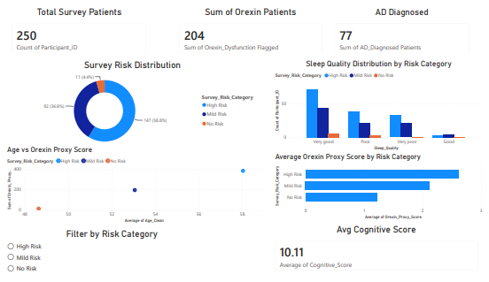

# Alzheimer's Disease Risk Stratification System

Final Year Project (FYP) — a multivariate machine learning pipeline that estimates cognitive-impairment / Alzheimer's risk by combining three independent data sources into one weighted ensemble score, with a Power BI dashboard and a Streamlit demo app.

## 📊 Overview

| Model | Data Source | Algorithm | Ensemble Weight |
|-------|-------------|-----------|-----------------|
| Model 1 | NACC CSF biomarkers + demographics + APOE4 | XGBoost | 65% |
| Model 2 | Sleep & orexin survey (250 participants) | Logistic Regression | 25% |
| Model 3 | Protein / albumin lab results (102 records) | Logistic Regression | 10% |

`Ensemble score = 0.65 × Model 1 + 0.25 × Model 2 + 0.10 × Model 3`. Scores are grouped into No / Mild / High risk (thresholds 0.30 and 0.40).

## 📈 Results

All results are on a 30% hold-out test set (`random_state=42`) unless stated otherwise.

**Individual models**

| Model | Data | AUC | Sensitivity | Specificity |
|-------|------|-----|-------------|-------------|
| Model 1 (XGBoost, 8 biomarker features) | NACC, 45,851 labeled records | 0.712 | 62.6% | 67.8% |
| Model 2 (sleep survey) | 250 participants | 0.594 (5-fold CV, ±0.256) | 60.9% | 55.8% |
| Model 3 (albumin) | 102 records (31 in test set) | 0.818 | 81.8% | 77.8% |

**Ensemble vs. clinical baseline (NACC test set)**

| Model | AUC | Sensitivity | Specificity | Precision |
|-------|-----|-------------|-------------|-----------|
| MMSE baseline (MMSE + age + sex) | 0.647 | 61.9% | 60.9% | 65.4% |
| Ensemble (threshold 0.40) | 0.700 (95% bootstrap CI 0.692–0.710) | 66.0% | 63.1% | 68.1% |

The ensemble's AUC is about **5.3 percentage points higher** than the MMSE baseline. A more sensitive threshold (0.25) gives 94.7% sensitivity at 17.5% specificity.

**Biomarker-only validation (Model 1 features, no MMSE/CDRGLOB as inputs):** AUC 0.706 against CDRGLOB ≥ 0.5 and 0.639 against MMSE ≤ 24.

### Limitations

- **Label:** The NACC label is derived from `NACCUDSD` (normal cognition vs. cognitively impaired / dementia). It is not restricted to confirmed Alzheimer's etiology.
- **How the ensemble is evaluated on NACC:** NACC has no sleep-survey or albumin data. For this evaluation, Model 2's input is NACC's orexin-proxy score and Model 3's input is a constant (the albumin training-set prevalence, 0.716). The reported ensemble AUC therefore mostly reflects Model 1 plus the orexin proxy. Models 2 and 3 were each validated only on their own small datasets.
- **Small samples:** The albumin model's test set has 31 records, and the survey model's cross-validated AUC varies widely across folds.
- **Discrimination is moderate.** The models are research prototypes and are not suitable for clinical use.

## 🗂️ Data

- **NACC** (National Alzheimer's Coordinating Center) — `alzheimer_clean_data.csv`
- **Sleep & orexin survey** — `survey_processed.csv`
- **Protein / albumin labs** — `albumin_data.xlsx`

> ⚠️ The datasets are **not included** in this repository. NACC data must be requested from NACC under their data use terms, and the survey and lab files contain participant-level information. To run the notebook, place your own copies of these three files in the same folder as the notebook. They are excluded by `.gitignore`.

## 🔬 ML Pipeline

The full pipeline is in [`alzheimers_pipeline.ipynb`](Multivariate_Alzheimer's_Disease_Risk_Stratification_Model.ipynb):

- Data loading, imputation, and preprocessing
- Three independent models, with cross-validation for the survey model
- MMSE baseline model for comparison
- Weighted ensemble meta-layer and risk categories
- Bootstrap confidence intervals
- Validation against MMSE and CDRGLOB
- Feature importance, ROC curves, and saved report files (`output/`)
- Model serialization: trained models and preprocessors are saved as `.pkl` files, with feature names in `model_features.json`

## 📸 Power BI Dashboard




## 🖥️ Streamlit Demo App

An interactive demo of the ensemble concept: patient input form, three sub-scores combined with the 65/25/10 weights, a risk category, and a downloadable summary.

> **Note:** In its current version, the app calculates each sub-score with simplified rule-based thresholds that mirror the structure of the ensemble. It does **not** load the trained models saved by the notebook, so its outputs are illustrative and are not the validated results reported above. Connecting the app to the trained models is planned future work.

[📹 Watch the demo video](demo.mp4)

## 📁 Repository Structure

```
.
├── README.md
├── alzheimers_pipeline.ipynb      # full ML pipeline
├── app_demo.mp4                   # app walkthrough
├── *.png                          # dashboard and app screenshots
├── app/
│   └── alzheimer_simple_gui.py    # Streamlit demo app
└── models/                        # trained models and preprocessors exported by the notebook
```

## 🚀 Getting Started

### Install

```bash
git clone https://github.com/Oshas-Shahid/alzheimers-risk-stratification.git
cd alzheimers-risk-stratification
python -m venv venv
# Windows:      venv\Scripts\activate
# macOS/Linux:  source venv/bin/activate
pip install -r requirements.txt
```

### Run the notebook

Open `alzheimers_pipeline.ipynb` in Jupyter or Google Colab, put your approved data files next to it (see Data), and run the cells in order.

### Run the app

```bash
streamlit run app/alzheimer_simple_gui.py
```

## 🛠️ Tools & Technologies

Python (pandas, NumPy, scikit-learn, XGBoost, Matplotlib, Joblib), Streamlit, Power BI, Excel.

## 👥 Team

- **Alizeh** — Model validation
- **Oshas Shahid**  Power BI dashboard
- **Laiba** — Thesis documentation

## ⚠️ Disclaimer

This is an academic research project. It is **not** a medical device and must not be used for clinical decisions or diagnosis.
